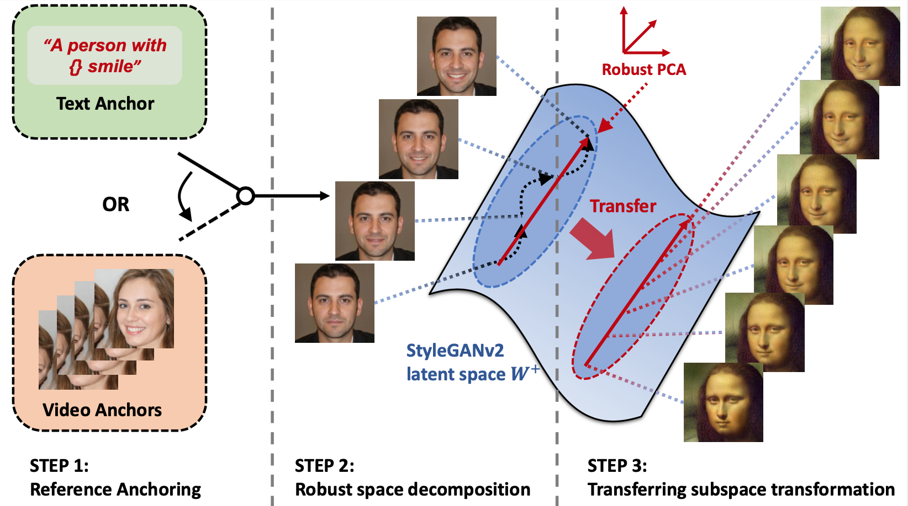

# Grasping the Arrow of Time from the Singularity: Decoding Micromotion in Low-dimensional Latent Spaces from StyleGAN
### [Project Page](https://wuqiuche.github.io/micromotion-project-page/) | [Paper](https://arxiv.org/abs/2204.12696)
### Demo: [](https://colab.research.google.com/drive/12x4OFh95gg9fTOvmMHKCbYco_GHfSZh5?usp=sharing)<br>

[Qiucheng Wu](https://wuqiuche.github.io/)\*<sup>1</sup>,
[Yifan Jiang](https://yifanjiang.net/)\*<sup>2</sup>,
[Junru Wu](http://sandbox3aster.github.io/)\*<sup>3</sup>,
[Kai Wang](https://scholar.google.com/citations?user=_yK8SN0AAAAJ&hl=en)<sup>5,6</sup>,
[Gong Zhang]()<sup>5,6</sup>,
[Humphrey Shi](https://www.humphreyshi.com/)<sup>4,5,6</sup>,
[Zhangyang Wang](https://vita-group.github.io/)<sup>2</sup>,
[Shiyu Chang](https://code-terminator.github.io/)<sup>1</sup>,
<br>
<sup>1</sup>University of California, Santa Barbara, <sup>2</sup>The University of Texas at Austin, <sup>3</sup>Texas A&M University, <sup>4</sup>UIUC, <sup>5</sup>University of Oregon, <sup>6</sup>Picsart AI Research

\*denotes equal contribution

This is the official implementation of the paper "Grasping the Arrow of Time from the Singularity: Decoding Micromotion in Low-dimensional Latent Spaces from StyleGAN".

## Overview
In this work, we hypothesize and demonstrate that a series of meaningful, natural, and versatile small, local movements (referred to as “micromotion”, such as expression, head movement, and aging effect) can be represented in low-rank spaces extracted from the latent space of a conventionally pre-trained StyleGAN-v2 model for face generation, with the guidance of proper “anchors” in the form of either short text or video clips. Starting from one target face image, with the editing direction decoded from the low-rank space, its micromotion features can be represented as simple as an affine transformation over its latent feature. Perhaps more surprisingly, such micromotion subspace, even learned from just single target face, can be painlessly transferred to other unseen face images, even those from vastly different domains (such as oil painting, cartoon, and sculpture faces).


## The workflow
Our complete workflow can be distilled down to three simple steps: (a) collecting anchor latent codes from a single identity; (b) enforcing robustness linear decomposition to obtain a noise-free low-dimensional space; (c) applying the extracted edit direction from low-dimensional space to arbitrary input identities.



## Prerequisite
Please setup the environment with provided ```environment.yml``` file:

```bash
conda env create -f environment.yml
conda activate test-grasping
pip install torch==1.7.1+cu110 torchvision==0.8.2+cu110 torchaudio===0.7.2 -f https://download.pytorch.org/whl/torch_stable.html
```

## Running Inference

We provided a colab to get started easily.

[](https://colab.research.google.com/drive/12x4OFh95gg9fTOvmMHKCbYco_GHfSZh5?usp=sharing)<br>

You can also clone the github repo.

```bash
git clone https://github.com/wuqiuche/micromotion-codebase.git
```
Download the pre-trained inverter, generator identity models.
- [Inverter](https://drive.google.com/file/d/1r5KSlQhf93fUllwqid80p4fxlzdR5A3f/view?usp=sharing), move it under ```restyle_encoder/pretrained_models/```
- [Generator](https://drive.google.com/file/d/1TaFSoIwbajdqYVlXMvD48XqaP4j2Xjy-/view?usp=sharing), move it under ```StyleCLIP/```
- [Identity](https://drive.google.com/file/d/1GBLxApwIXbbyi3GLfY0Rc7o-XaAyP_zJ/view?usp=sharing), move it under ```StyleCLIP/```

#### Reproduce results from pre-trained micromotion latents

In-Distribution Results

| Image  | Micromotion | Command                                                           |
|--------|-------------|-------------------------------------------------------------------|
| 01.jpg | "Angry"     | ```python main.py --category angry --input examples/01.jpg``` |

Out-of-Distribution Results

| Image    | Micromotion    | Command                                                                  |
|----------|----------------|--------------------------------------------------------------------------|
| mona_lisa.jpg  | "Smile" | ```python main.py --category smile --input examples/mona_lisa.jpg``` |
| aerith.png | "Aging"  | ```python main.py --category aging --input examples/aerith.png```        |
| pope.jpg | "Closing Eyes" | ```python main.py --category eyesClose --input examples/pope.jpg```      |
| van_gouh.jpg | "Turning Head" | ```python main.py --category headsTurn --input examples/van_gouh.jpg```  |

Videos will be generate  under folder ```results```.

## Running Training

```bash
python main.py --category CATEGORY --template TEMPLATE --seed SEED --input INPUT
```

Arguments

```--input``` define the input image

```--category``` define pretrained micromotion latents, use "custom" to specific text template.

```--template``` define text template for micromotions.

```--seed``` specifies seed for the anchor facial image for micromotion, the anchor facial image will be saved under ```text```

 
Micromotions and its corresponding text templates used in the paper

| Micromotion   | Template  | Command                                                                                                          |
|---------------|----------------------------------------------------------------------|------------------------------------------------------------------------------------------------------------------|
| "Smile"       | "a person with {degree} smile" | ```python main.py --category custom --template "a person with {degree} smile" --input examples/mona_lisa.jpg```  |
| "Aging"       | "a {degree} old person" | ```python main.py --category custom --template "a {degree} old person with gray hair" --input examples/aerith.png```            |
| "Closing Eyes" | "a person with eyes {degree} closed" | ```python main.py --category custom --template "a person with eyes {degree} closed" --input examples/pope.jpg``` |
| "Angry"   | "{degree} angry" | ```python main.py --category custom --template "{degree} angry" --input examples/01.jpg```                       |

Videos will be generate  under folder ```gifs```.

## Results

#### In-Distribution Results

https://user-images.githubusercontent.com/35078967/164549660-e4802907-47d4-4f72-a452-8dff24405aba.mp4

#### Out-of-Distribution Results

###### Painting

https://user-images.githubusercontent.com/35078967/164549779-0a70052b-19f2-479c-b64d-d106af449d8e.mp4

###### Video Game

https://user-images.githubusercontent.com/35078967/164549826-efd0e4d0-ed02-4ad1-a122-a1cf72af3b7d.mp4

###### Sketch

https://user-images.githubusercontent.com/35078967/164549869-a36de442-d996-47f5-ace6-b95266c92b5c.mp4

###### Statue

https://user-images.githubusercontent.com/35078967/164549899-d89eb0b3-fc67-41ae-b436-dd54d9260fd2.mp4


## Parent Repository

This code is adopted from <a href="">https://github.com/orpatashnik/StyleCLIP</a> and <a href="">https://github.com/yuval-alaluf/restyle-encoder</a>. 


